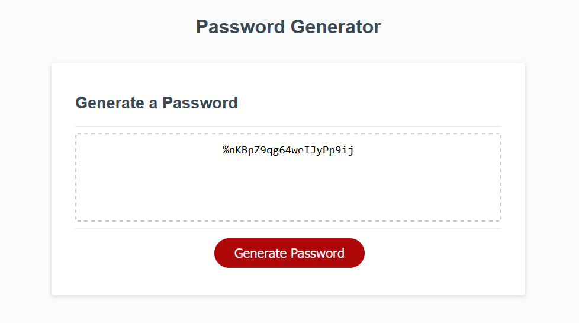

# <JavaScript-Password-Generator>

## Description

This project was used as a way to devlop my JavaScript abilites.  It is a simple password generator that generates based off of given criteria, such as uppercase, lowercase, numbers and special characters.  During this project I've gained much better knowledge of arrays and random generation through arrays.

## Usage

Here is what the project looks like.  If you want to preview it click [HERE!](https://parksfg.github.io/Javascript-Password-Generator/)

